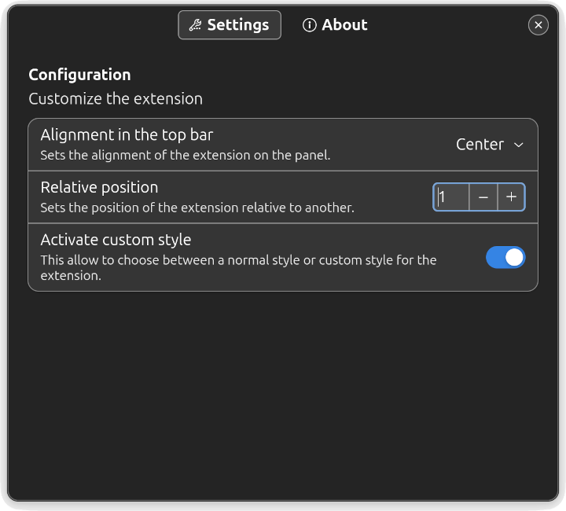

| **`Actividad`** | **`Versión`** | **`Lenguaje`** | **`Licencia`** |
|:---------------:|:-------------:|:--------------:|:--------------:|
|||||

# Whoami (comando de Linux) en el panel superior
La extensión **GNOME Shell Whoami en el panel superior** muestra la salida del
comando `whoami` con un estilo personalizado. `whoami` es un comando simple el
cual muestra el identificador del usuario actual.


## Instalación
### Dependencias
La extensión requiere del comando `whoami` el cual está incluido en el paquete
_Coreutils_ (Herramientas básicas de GNU). _Coreutils_ es un paquete esencial
instalado por defecto en la gran variedad de distribuciones Linux.

La extensión **GNOME Shell Whoami en el panel superior** requiere
`GNOME Shell` con versión 45 o superior.

### Compatibilidad
Actualmente, la extensión **GNOME Shell Whoami en el panel superior**
ha sido probada con éxito en Ubuntu Noble (24.04) y Manjaro Wynsdey
(24.0.6).

### Desde el código fuente
Puede descargar o clonar el repositorio del código fuente a través de la terminal
usando herramientas usuales de desarrollo (git, make, gettext):
```
git clone https://github.com/mikemolina/whoami-topbar.git
```
Navegar hacia el directorio descargado y simplemente ejecutar:
```
make compile
make install
```
Las anteriores instrucciones hacen una instalación local a nivel de usuario. Para
una instalación a nivel de sistema (usando permisos de administrador) ejecutar:
```
make install PLACEINSTALL=system prefix=/usr
```

### Post-instalación
Si la sesión está bajo `Xorg`, reiniciar la sesión de usuario de GNOME Shell
ejecutando <kbd>Alt</kbd>+<kbd>F2</kbd>, ingresar <kbd>R</kbd> y luego
<kbd>Enter</kbd>. Para reiniciar la sesión bajo `Wayland` salir de la sesión
actual y volver a ingresar.
La extensión se puede activar usando un _Gestor de Extensiones_ o desde un
navegador con el enlace
[https://extensions.gnome.org/local/](https://extensions.gnome.org/local/).  Un
gestor recomendado es el incluido en el paquete
[gnome-shell-extension-manager](https://packages.ubuntu.com/noble/gnome-shell-extension-manager)
para distribuciones Debian/Ubuntu o a través del paquete [Extension
Manager](https://flathub.org/apps/com.mattjakeman.ExtensionManager) disponible
desde Flathub.

## Personalización y ajustes
Es posible personalizar la extensión **GNOME Shell Whoami en el panel superior**
cambiando la alineación desde la ventana de preferencias, o la fuente tipográfica
del texto modificando manualmente el archivo `stylesheet.css`. El procedimiento se
realiza en unos pocos pasos:

1. Consultar y descargar una fuente desde [Google
   Fonts](https://fonts.google.com/). Por ejemplo, la fuente
   [Matemasie](https://fonts.google.com/specimen/Matemasie) diseñada por _Adam
   Yeo_.
2. Extraer el archivo `*.ttf` e instalar la fuente mediante una interfaz gráfica
   como `GNOME Font Viewer` o manualmente a través de la línea de comandos. Si
   prefiere la línea de comandos, el proceso consiste en crear un directorio de
   uso local para la nueva fuente, copiar la fuente y actualizar la base cache de
   fuentes del sistema:
   ```
   mkdir -p ~/.local/share/fonts/truetype/Matemasie
   cp Matemasie-Regular.ttf ~/.local/share/fonts/truetype/Matemasie
   fc-cache -fv
   ```
   Verificar que la nueva fuente se agregó correctamente ejecutando:
   ```
   fc-match Matemasie
   ```
3. Con un editor de texto (nano, vim, emacs, gedit, ...), abrir el archivo:
   ```
   ~/.local/share/gnome-shell/extensions/whoami-topbar@mikemolina.github.io/stylesheet.css
   ```
   para modificar las opciones del bloque `'Style 1'`. En la opción `font-family`
   use el nombre de la fuente generada por el comando `fc-match`.
   ```css
   /* Style 1: -> Custom */
   .whoami-label_style-1 {
	font-family: 'Matemasie';
	...
   }
   ```
   Guardar los cambios y cerrar el editor.
4. Reiniciar la extensión y desde el gestor de extensiones activar el switch de
   personalización.
   
   

## Como traducir
Es recomendable clonar el repositorio y navegar hacia el directorio descargado
para realizar modificaciones relacionadas con traducciones.

### Actualizar la plantilla de traducciones
Si existen cadenas de texto modificadas/agregadas en alguno de los archivos `*.js`
es necesario actualizar la plantilla de traducciones `*.pot`. Usar:
```
make update-localization
make update-translation
```
Luego, actualizar la traducciones de los respectivos idiomas y reinstalar la
extensión:
```
make uninstall
make compile
make install
```

### Agregar una nueva traducción
Para agregar una nueva traducción:
```
make translation PO_LANG=XX_cc
```
'**XX_cc**' es el [código
estándar](https://www.gnu.org/software/gettext/manual/html_node/Language-Codes.html)
para identificar la traducción de un país específico. Realizar la traducciones en
el nuevo archivo po generado `po/XX_cc.po` y reinstalar la extensión.

### Enviar la traducción
Si usted, tiene el espirítu de contribuir con una corrección/traducción se invita
a crear un [Reporte](https://github.com/mikemolina/whoami-topbar/issues) a la
página del proyecto con asunto titulado "_Revisión de traducción_". Envíe una
nota/parche de corrección o adjunte el archivo `*.po` con una traducción.

## Ver también
Acerca del comando `whoami` en
<[https://www.gnu.org/software/coreutils/whoami](https://www.gnu.org/software/coreutils/whoami)>
o vía página manual en la terminal:
```
man whoami
```

## Licencia
La extensión **Whoami en el panel superior** es software libre y se distribuye
bajo los términos de la Licencia Pública General de GNU, versión 3 o posterior,
incluida con el código fuente en el archivo _COPYING_.

## Créditos
La extensión **Whoami en el panel superior** fue desarrollada con
funciones/declaraciones inspiradas en las extensiones:

- [Add Username to Top Panel](https://github.com/brendaw/add-username-toppanel)
  por
  [brendaw](https://extensions.gnome.org/extension/1108/add-username-to-top-panel/).
- [Freon](https://github.com/UshakovVasilii/gnome-shell-extension-freon) por
  [UshakovVasilii](https://extensions.gnome.org/extension/841/freon/).
- [OpenWeather Refined](https://github.com/penguin-teal/gnome-openweather/) por
  [tealpenguin](https://extensions.gnome.org/extension/6655/openweather/).
- [Simple net speed](https://github.com/biji/simplenetspeed) por
  [bijignom](https://extensions.gnome.org/extension/1085/simple-net-speed/).
- [BackSlide](https://gitlab.com/p91paul/BackSlide) por
  [p91paul](https://extensions.gnome.org/extension/543/backslide/).

Agradecimientos al [Proyecto GNOME](https://gjs.guide/extensions/) por facilitar
los conocimientos esenciales de **GJS**, y así lograr el desarrollo de la
extensión **Whoami en el panel superior** .
