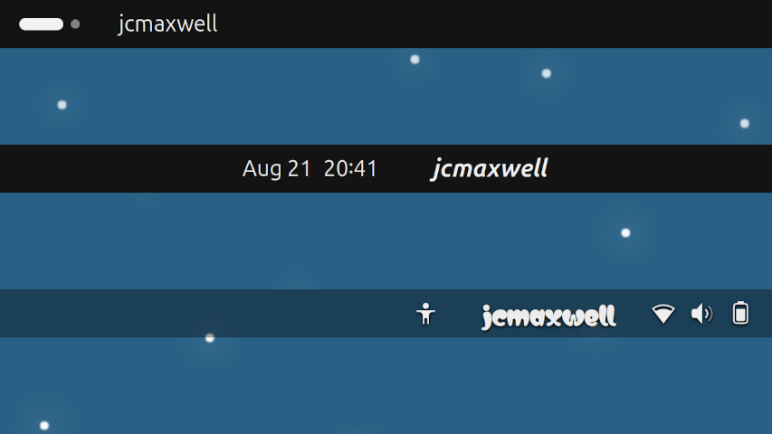
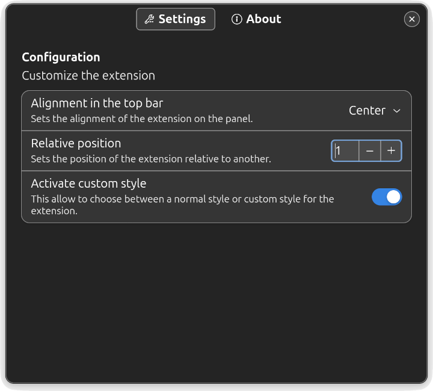

| **`Activity`** | **`Version`** | **`Language`** | **`License`** |
|:--------------:|:-------------:|:--------------:|:-------------:|
|||||

# Whoami in top bar
The **Whoami in top bar GNOME Shell** extension displays the current user ID, same
as output of the `whoami` command, with a custom style in top bar.



## Install
### Dependencies
**Whoami in top bar GNOME Shell** extension requires `GNOME Shell` with version 45
or higher.

### Compatibility
Currently, **Whoami in top bar GNOME Shell** extension has been successfully
tested in Ubuntu Noble (24.04) and Manjaro Wynsdey (24.0.6).

### From source code
You can download or clone the source code from repository via terminal using
common development tools (git, make, gettext):
```
git clone https://github.com/mikemolina/whoami-topbar.git
```
Navigate to the downloaded directory and simply run:
```
make compile
make install
```
The instructions above perform a local user-level installation. For a system-level
installation (using administrator permissions), run:
```
make install PLACEINSTALL=system prefix=/usr
```

### Post-install
If the session is under `Xorg`, restart the GNOME Shell user session by running
<kbd>Alt</kbd>+<kbd>F2</kbd>, entering <kbd>R</kbd> and then <kbd>Enter</kbd>. To
restart the session under `Wayland`, log out of the current session and log back
in.
The extension can be enabled using an _Extension Manager_ or from a browser with
the link
[https://extensions.gnome.org/local/](https://extensions.gnome.org/local/). A
recommended manager is the one included in the package
[gnome-shell-extension-manager](https://packages.ubuntu.com/noble/gnome-shell-extension-manager)
for Debian/Ubuntu distributions or through the [Extension
Manager](https://flathub.org/apps/com.mattjakeman.ExtensionManager) package
available from Flathub.

## Custom and settings
It is possible to customize the **Whoami in top bar GNOME Shell** extension by
changing the alignment from the preferences window, or the font of the text
manually modifying the `stylesheet.css` file. The procedure is done in a few
steps:

1. View and download a font from [Google Fonts](https://fonts.google.com/). For
   example, the [Matemasie](https://fonts.google.com/specimen/Matemasie) font
   designed by _Adam Yeo_.

2. Extract the `*.ttf` file and install the font using a graphical interface such
   as `GNOME Font Viewer` or manually via the command line. If you prefer the
   command line, the process involves creating a local directory for the new font,
   copying the font, and update the system font cache:
   ```
   mkdir -p ~/.local/share/fonts/truetype/Matemasie
   cp Matemasie-Regular.ttf ~/.local/share/fonts/truetype/Matemasie
   fc-cache -fv
   ```
   Verify that the new font was successfully added by running:
   ```
   fc-match Matemasie
   ```
3. Using a text editor (nano, vim, emacs, gedit, ...), open the file:
   ```
   ~/.local/share/gnome-shell/extensions/whoami-topbar@mikemolina.github.io/stylesheet.css
   ```
	to modify the options in `'Style 1'` block. In the `font-family` option use
    the name of the font generated by the `fc-match` command.
   ```css
   /* Style 1: -> Custom */
   .whoami-label_style-1 {
	font-family: 'Matemasie';
	...
   }
   ```
   Save changes and close the editor.
4. Restart the extension and from the extension manager enable the customization
   switch.
   
   

## How to translate
It is recommended to clone the repository and navigate to the downloaded directory
to make modifications related with translations.

The extension currently has translations for spanish, french and portuguese
(Brazil). Contributions and corrections are _Welcome_.

### Update the translation template
If there are modified/added text strings in any of the `*.js` files, it is
necessary to update the `*.pot` translation template. Use: 
```
make update-localization
make update-translation
```
Next, update the translations for the respective languages and reinstall the
extension:
```
make uninstall
make compile
make install
```

### Adding a new translation
To add a new translation:
```
make translation PO_LANG=XX_cc
```
'**XX_cc**' is the [standard
code](https://www.gnu.org/software/gettext/manual/html_node/Language-Codes.html)
to identify a specific country's translation. Perform translations in new
generated po file `po/XX_cc.po` and reinstall the extension.

### Submitting a translation
If you have the spirit to contribute with a correction/translation, you are
invited to create a [Report](https://github.com/mikemolina/whoami-topbar/issues)
to the project page with the subject titled "_Translation review_". Submit a
correction note/patch or attach the `*.po` file with a translation.

## See also
About `whoami` command in
<[https://www.gnu.org/software/coreutils/whoami](https://www.gnu.org/software/coreutils/whoami)>
or via manual page in the terminal:
```
man whoami
```

## License
**Whoami in top bar** extension is free software and is distributed under the
terms of the GNU General Public License, version 3 or later, which is included in
this distribution in the file _COPYING_.

## Credits
**Whoami in top bar** extension was developed with functions/declarations inspired
by the extensions:

- [Add Username to Top Panel](https://github.com/brendaw/add-username-toppanel) by
  [brendaw](https://extensions.gnome.org/extension/1108/add-username-to-top-panel/).
- [Freon](https://github.com/UshakovVasilii/gnome-shell-extension-freon) by
  [UshakovVasilii](https://extensions.gnome.org/extension/841/freon/).
- [OpenWeather Refined](https://github.com/penguin-teal/gnome-openweather/) by
  [tealpenguin](https://extensions.gnome.org/extension/6655/openweather/).
- [Simple net speed](https://github.com/biji/simplenetspeed) by
  [bijignom](https://extensions.gnome.org/extension/1085/simple-net-speed/).
- [BackSlide](https://gitlab.com/p91paul/BackSlide) by
  [p91paul](https://extensions.gnome.org/extension/543/backslide/).

Acknowledge to the [GNOME Project](https://gjs.guide/extensions/) for providing
essentials knowledges of **GJS**, which led to the development of the **Whoami
extension in the top panel**.
